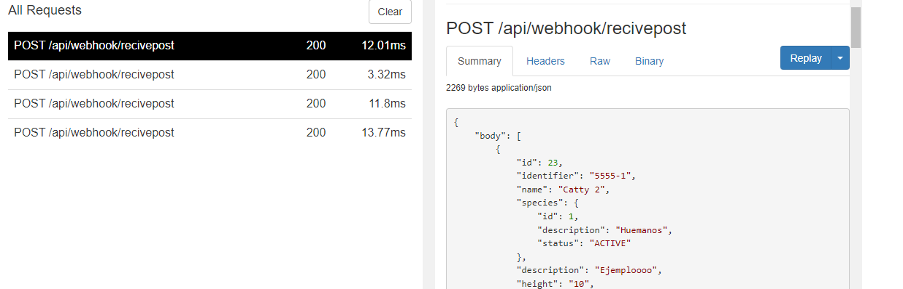

# ANIMALIA REST API
## _Api rest para la gestión de ciudadano ANIMALIA - Reto_

Desarrollo de api rest usando las siguientes tecnologías:.

- ✨Java Spring Boot
- ✨Postgresql
- ✨Docker
- ✨Aws
- ✨Heroku

## Funcionalidaes

1. Dar de alta un nuevo ciudadano
2. Actualizar la información de un ciudadano existente
3. Eliminar un ciudadano existente
4. Consultar un ciudadano existente por ID
5. Realizar búsquedas de ciudadanos por diferentes criterios: nombre, especie,
   descripción, rol y si el ciudadano posee mascota humana. Deben soportarse las
   búsquedas por uno o más criterios.
6. Dar de alta varios ciudadanos al mismo tiempo
7. Notificar a usuario registrado como organización cuando se crear un ciudadano a traves de Webhook

# Instalación

## DataBase

### En ambiente local
Crear una instancia de base de datos con postgresql.

Más información : https://www.postgresql.org/docs/

### En ambiente productivo

Crear una instancia de base de datos en AWS.

Más información : https://aws.amazon.com/es/getting-started/hands-on/create-connect-postgresql-db/

### Configuración archivo resource/aplication.properties

```sh
spring.datasource.url=jdbc:postgresql://host/mydatabase
spring.datasource.username=root
spring.datasource.password=root
spring.jpa.show-sql=true
spring.jpa.properties.hibernate.dialect = org.hibernate.dialect.PostgreSQLDialect
spring.jpa.hibernate.ddl-auto=update
spring.mvc.pathmatch.matching-strategy=ant-path-matcher
```

## Spring boot proyecto (JAVA)

Para ejecutar el proyecto de forma local se debe:

1. Debe tener instalado en su maquina local maven
2. Descargar el proyecto de este repositorio
3. Configurar el archivo aplication.properties con las indicaciones dada en el paso anterior.
4. Ejecutar el siguiente comando por consola.
   ```sh
   ./mvnw spring-boot:run
   ```
El proyecto quedará disponible para su uso de forma local en la url: http://localhost:8080/

## Docker

Animalia es muy fácil de instalar e implementar en un contenedor Docker.

De forma predeterminada, Docker expondrá el puerto 8080, así que cámbielo dentro del
docker-compose.yml si es necesario. Cuando esté listo, simplemente use el docker-compose.yml para
construir la imagen.

```sh
docker-compose up
```

Verifique la implementación navegando a la dirección de su servidor en
postman haciendo una petición algunos de los servicios ofrecidos por la api rest.

```sh
127.0.0.1:8000
```

# WEBHOOK

El desarrollo implementa un webhook con el fin notificar a usuarios externos de eventos realizados sobre nuestra aplicación.

Para su configuración debe seguir los siguiente pasos:

1. Exponer su url local a internet, para esto se puede hacer uso de la herramienta Ngrok https://ngrok.com/download
2. Una vez se obtiene la url publica de su locahost, se debe configurar dentro de la base de datos de animalia, para esto debe crear su organización en el servicio
   ```sh
   /api/webhook/createwebhook
   
   Ejemplo:
      {
        "organization": "Ejemplo",
        "status": "ACTIVE",
        "url_notification": "http://3386-190-84-119-66.ngrok.io/api/webhook/recivepost"
      }
      ```
   Nota: /api/webhook/recivepost es un controller de prueba para validar que las notificaciones llegen a la url parametrizada. Por esto a la url que entrega Ngrok se debe concatenar el siguienet path: /api/webhook/recivepost  
3. Cre un ciudadano y valide en el inspector de ngrok que la notificación ha sido recibida.

   Ejemplo:



## License

MIT

**Free Software, Yeah!**
